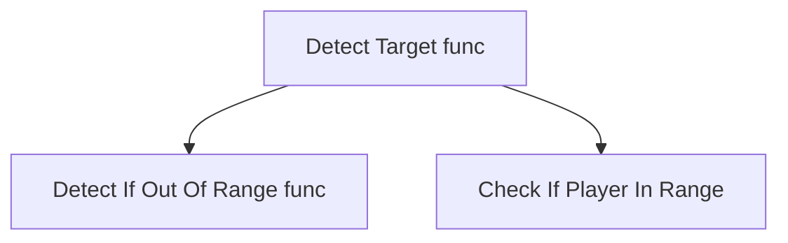
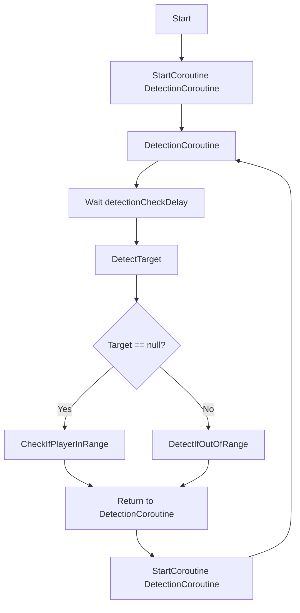

Variables defined and for what they are required and what need to be aciheved.
- A view Radius - forms a circular area where it can detect the player, enemy, other objects.
	- The main thing is  detect the  player in that area.
- Detection Check delay makes the turret delay its detection so that it feels more human like.
- Target transform is null initially as the player has not entered the view radius.
- Player Layer Mask, Visibility Layer here to make the tank only detect the player and not near by enemy using Player Layer mask as the target layer layer for attacking.
- Target Visible is bool so when target is visible it will become true and can start the next process.


```csharp

private void Update()
{
    if (Target != null)
        TargetVisible = CheckTargetVisible();
}

private bool CheckTargetVisible()
{
    var result = Physics2D.Raycast(transform.position, Target.position - transform.position, viewRadius, visibilityLayer);
    if(result.collider != null)
    {
        return (playerLayerMask & (1 << result.collider.gameObject.layer)) != 0;
    }
    return false;
}
```

# Fuction of the above code.
The Update method is called every frame which calls the CheckTargetVisible() method every frame.
## CheckTargetVisible() method

| Access Level | Private |
| ------------ | ------- |
| return type  | bool    |

  - casts a ray such a way that it covers a radius given above, with the visibility layer as a constrain to detect the specified on the visibility layer in our case it is Player, Enemy and Hitables.
- If it collides with any of the objects above it checks for Player using the PlayerLayerMask . The ray detects the collider and returns it true or false on the entry of player.
```return (playerLayerMask & (1 << result.collider.gameObject.layer)) != 0;```


else it will return false if no player 

```csharp
    private void DetectTarget()
    {
        if (Target == null)
            CheckIfPlayerInRange();
        else if (Target != null)
            DetectIfOutofRange();

    }

    private void DetectIfOutofRange()
    {
        if (Target == null || Target.gameObject.activeSelf == false || Vector2.Distance(transform.position, Target.position) > viewRadius + 1)
        {
            Target = null;
        }
    }

    private void CheckIfPlayerInRange()
    {
        Collider2D collision = Physics2D.OverlapCircle(transform.position, viewRadius, playerLayerMask);
        if (collision != null)
        {
            Target = collision.transform;
        }
    }
```




```csharp

    IEnumerator DetectionCoroutine()
    {
        yield return new WaitForSeconds(detectionCheckDelay);
        DetectTarget();
        StartCoroutine(DetectionCoroutine());
    }
```
This calls a Coroutine. For specified time using WaitForSeconds().
Then we can call the DetectTarget() and recursively call Coroutine using Start Coroutine()




# Design Study AI Detector

## Questions to Ask

- What responsibilities does AI Detector Have?
- What State does it maintain?
- Why are there 2 detections systems?
- why does detection use a Coroutine instead Update?
- Identifies the feature's dependencies?


# What responsibilities does AI Detector Have?

## My Understanding 
- Detects a player within a specified radius. 
- Maintains a current target.
- Searches for a target when none exists.
- Checks whether the existing target has left the valid range. 
- Performs detection periodically.
## Evidence code 

```csharp
	private float viewRadius = 11;

	private float detectionCheckDelay = 0.1f;
	
	
   private void DetectTarget()
   {
       if (Target == null)
           CheckIfPlayerInRange();
       else if (Target != null)
           DetectIfOutofRange();

   }

   private void DetectIfOutofRange()
   {
       if (Target == null || Target.gameObject.activeSelf == false || Vector2.Distance(transform.position, Target.position) > viewRadius + 1)
       {
           Target = null;
       }
   }

   private void CheckIfPlayerInRange()
   {
       Collider2D collision = Physics2D.OverlapCircle(transform.position, viewRadius, playerLayerMask);
       if (collision != null)
       {
           Target = collision.transform;
        }
    }
```


## Hypothesis 
- The detection delay may reduce unnecessary physics queries. 
- The `+1` in the range check may prevent rapid target loss/reacquisition near the detection boundary.

## Investigation 
- Why exactly `0.1f`? 
- Why is target loss checked at `viewRadius + 1`?
- Why use a Coroutine for target acquisition but `Update()` for visibility?
- Why use `OverlapCircle()` for acquisition?
- Why use a `Raycast()` for visibility?